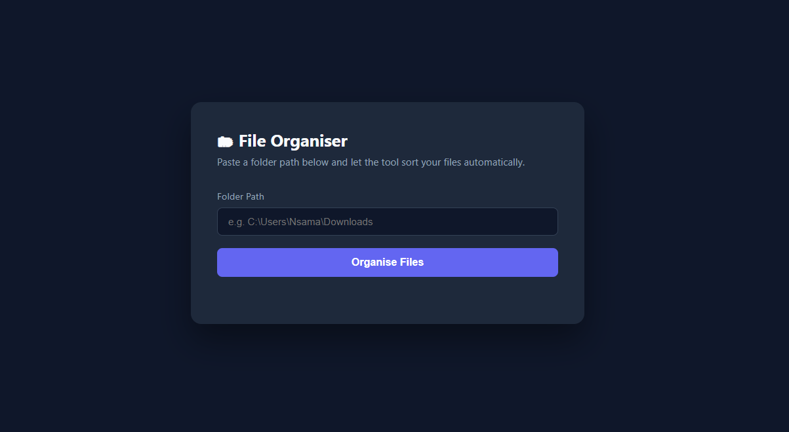
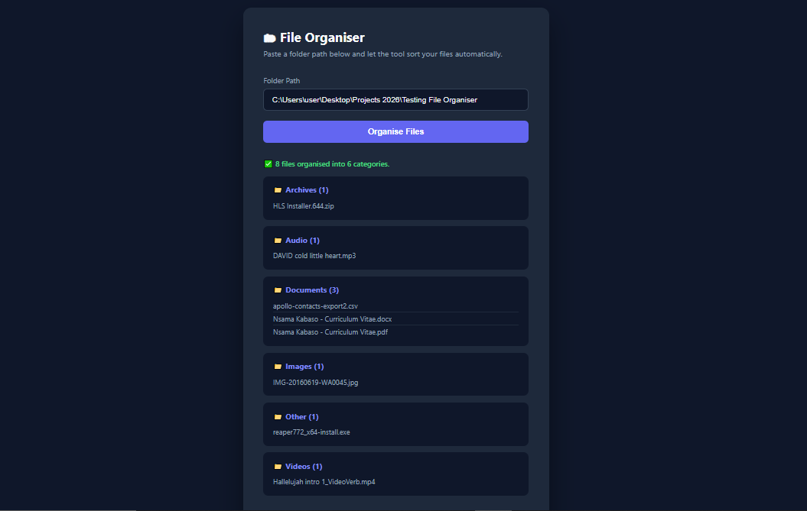

# 🗂 File Organiser

A lightweight web app that automatically sorts files in a folder into categorised subfolders — built with Python and Flask.

## 🔍 What it does

Point it at any folder on your machine and it will sort your files into:
- **Images** (.jpg, .png, .gif, etc.)
- **Documents** (.pdf, .docx, .xlsx, etc.)
- **Videos** (.mp4, .mkv, .avi, etc.)
- **Audio** (.mp3, .wav, .flac, etc.)
- **Code** (.py, .js, .html, etc.)
- **Archives** (.zip, .rar, .tar, etc.)
- **Other** (anything that doesn't fit above)

Results are displayed instantly in the browser showing exactly what was moved and where.

## 🛠 Tech Stack

- **Python** — core file handling logic (`os`, `shutil`)
- **Flask** — lightweight web server
- **HTML/CSS/JavaScript** — frontend UI (no frameworks)

## 🚀 Getting Started

**1. Clone the repository**
```bash
git clone https://github.com/YOUR-USERNAME/file-organiser.git
cd file-organiser
```

**2. Create and activate a virtual environment**
```bash
python -m venv venv
venv\Scripts\activate
```

**3. Install dependencies**
```bash
pip install -r requirements.txt
```

**4. Run the app**
```bash
python app.py
```

**5. Open your browser and go to:**
http://127.0.0.1:5000

## 📸 Preview





## ⚠️ Note

This tool moves files permanently. It is recommended to test it on a copy of a folder first before running it on important directories.

## 👤 Author

**Nsama Kabaso** — [GitHub](https://github.com/YOUR-USERNAME)
